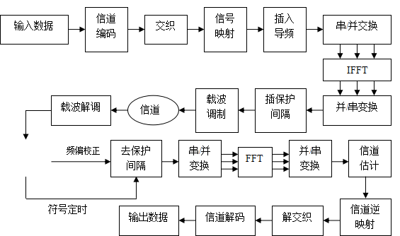

# OFDM

FDM：频分复用——将传输信道的总带宽划分为若干子信道，每个信道传输1路信号。

OFDM属于光域的波分复用系统，但是其光载波占用的频段极窄，且光源发光频域极其精确，所以用光频分复用更精确些。

OFDM：最初（或许也是现在的目的）：将高速传输的数据经过串并转换，变成低速并行的数据，将数据进行调制，然后放到并行正交载波上进行传输。主要目的是子载波的带宽较小，可以有效对抗频率选择性衰弱。

**各个子信道的正交调制和解调可通过离散傅里叶反变换IDFT和离散傅里叶变换DFT实现。**

优缺点：OFDM优点: 采用正交频分复用可以提高电力线网络传输质量，它是一种多载波调制技术。传输质量的不稳定意味着电力线网络不能保证如语音和视频流这样的实时应用程序的传输质量。然而，对于传输突发性的Internet数据流它却是个理想的网络。即便是在配电网受到严重干扰的情况下，OFDM也可提供高带宽并且保证带宽传输效率，而且适当的纠错技术可以确保可靠的数据传输。OFDM的主要技术特点如下： （1）可有效对抗信号波形间的干扰，适用于多径环境和衰落信道中的高速数据传输； （2）通过各子载波的联合编码，具有很强的抗衰落能力； （3）各子信道的正交调制和解调可通过离散傅利叶反变换IDFT和离散傅利叶变换DFT实现； （4）OFDM较易与其它多种接入方式结合，构成MC-CDMA和OFDM-TDMA等。OFDM缺点:1.传送与接收端需要精确的同步 2.对于都普勒效应频率飘移的敏感 3.峰值对平均功率\(PAPR\)的比例高

