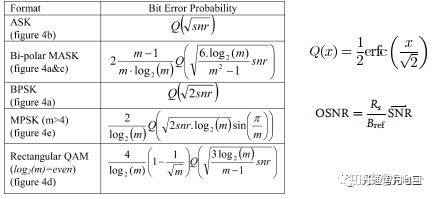

# 系统性能分析

### EVM-Analysis函数分析

EVM\(百度\)：Error Vector Magnitude-误差矢量幅度。误差向量是一个给定时刻理想无误差基准信号与实际发射信号的向量差，能全面衡量调制信号的幅度误差和相位误差。EVM具体表示发射机对信号进行解调时产生的IQ分量与理想分量的接近程度，是考量调制信号质量的一种标准。EVM定义为误差矢量信号平均功率的均方根值与理想信号平均功率的均方根值之比。EVM越小信号质量越好。

EVM（CSDN）：EVM表征调制精度，是衡量现代无线通信系统中数字调制质量的一项关键指标。EVM是发射信号的理想的测量分量\(同向位\)I和（正交相位）Q与实际接收到的测量信号“M”的I,Q分量幅度之间的矢量差。RMS EVM定义为平均误差矢量功率与平均基准功率的比值的平方根。EVM可观察到信号的质量，与误码率成正比，与信噪比SNR以及信号与噪声加失真比SNDR也有直接关系。

SNR：信噪比：$$SNR=\frac{P_s}{N}=\frac{E_SR_S}{N_0R_S}=E_SN_0$$，$$P_S$$是信号功率，$$R_s$$是信号带宽

OSNR：光信噪比：$$OSNR_{sp}=\frac{P_s}{2N_{ase}B_{ref}}=\frac{R_sE_s}{2N_{0}B_{ref}}=\frac{R_s}{2B_{ref}}SNR$$

EVM、SNR，BER和Q的关系：CSDN：$$EVM_{RMS}=\sqrt \frac{1}{SNR}$$,$$BER=\frac{1}{2}*erfc  \frac {Q}{\sqrt{2}}$$,EVM计算公式：$$EVM_{RMS}=\sqrt {\frac{\frac{1}{N}\sum|S_{re}-S_{ideal}|^2}{\frac{1}{M}\sum{|S_m|^2}}}$$,$$S_{re}$$$$S_{ideal}$$分别为接收信号和理想信号，M为调制阶数，N为信号数量，$$S_m$$为理想星座图点。BER和SNR的关系如图：\(**函数里用的公式是MASK的**\)

EVM-Analysis函数：先进行判断哪个点属于哪个星座点，进行记录。然后计算EVM：$$\frac{\sum \sqrt{(|Y-X|^2)}}{L*\sqrt{(\frac{\sum|±1±j|)}{4}}}$$其中：Y为判断后得星座点，X为判断前得星座点，L为X和Y的长度。计算SNR：$$\frac{1}{EVM^2}$$;误码率BER可通过EVM来计算：$$\left( \frac{1-\frac{1}{m}}{log_2m} \right) *erfc \sqrt{(\frac{3*log_2m}{(m^2-1)*EVM^2})}$$.Q因子和SNR求得数据一样。注意：**这里我们的X是按照1+j的标准来的**，而函数Y是按照0.7+0.7j来的，实际求EVM时会有偏大的计算差。

constref函数：返回参数化的常规参考星座图，即4QPSK为±1±1j四个向量。

pwr函数：描述了信号功率和信噪比。其中的meanpwr函数：平均信号功率和能量。（归一化，（1+j）变成了（0.7071+0.7071j））

hd\_euclid函数：用最小欧几里得符号判决属于哪个星座点

## 光谱效率

单位：bits/s/HZ

