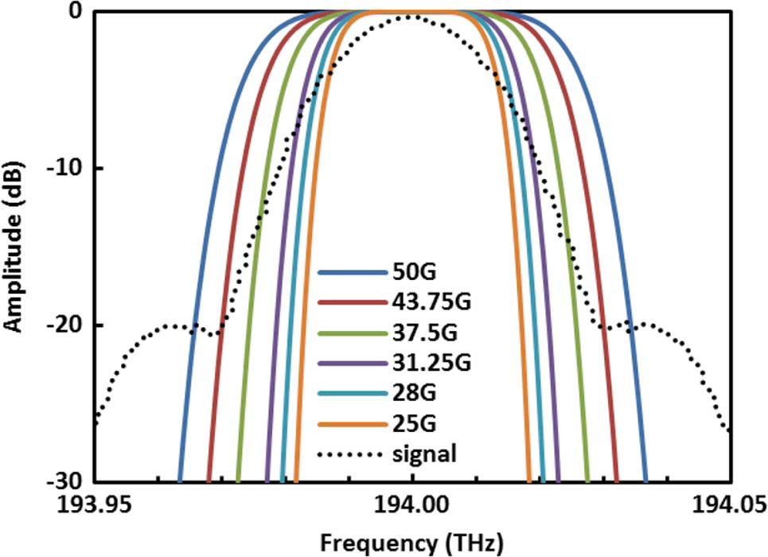

# 21-23

## Inter-Channel Crosstalk Cancellation for Nyquist-WDM Superchannel Application's

对于奈奎斯特-WDM系统，时间信号是奈奎斯特脉冲，这样就有平坦相位的均匀频谱密度。最大后验概率MAP最容易在信道间隔等于波特率的系统中实现，自适应线性均衡对所有信道间隔都有效。

【1】——【5】相干光正交频分复用CO-OFDM满足频域正交性，频域为sinc函数；【5】——【10】奈奎斯特WDM系统满足时域正交性，时域信号为sinc函数，带宽等于波特率的理想矩阵，当在奈奎斯特脉冲的过零点采样时，系统没有码间干扰。【11】——【13】奈奎斯特WDM系统的传统ICI可能因为达不到完美条件而使用DSP来进行补偿窄带滤波损伤。【5】——【6】使用预滤波或预失真来强调发射信号的高频分量，从而补偿级联滤波效应。

本文：演示了两种架构，可以联合信道间串扰消除，同时联合检测和解调多个子信道。第一种：基于最大MAP检测【15】，第二种：基于联合线性均衡【14】。这里将MAP规则应用到DQPSK系统。联合线性均衡应用于COOFDM系统，该系统使用同一接收机接收多载波进行串扰消除。第二节：说明了奈奎斯特WDM系统的ICI基于DSP的消除理论和方法。第三节：介绍了两种基于MAP和自适应线性均衡器的ICI消除方法。剩下就是结果和分析了。

波特率间隔的三通道奈奎斯特WDM系统的ICI：MAP：分为训练和补偿模式。首先：将传送每种可能的QPSK序列进行训练几次——将每个联合星座状态的失真符号平均并存储为查找表——接下来看不懂，有兴趣再回过来仔细研究吧。自适应线性均衡：需要精确的频移间隔量【19】，CMA的思路，补偿系数来补偿数据，基于最小均方算法LMS来更新滤波器系数。

**信号由升余弦时域滤波器整型**，三个锁相子载波中的每一个都用112Gbps的DPNRZQPSK调制。这些子信号进一步由3.5阶超高斯光学滤波器整型，有意放宽一些光学滤波器带宽，以评估ICI消除的有效性。

